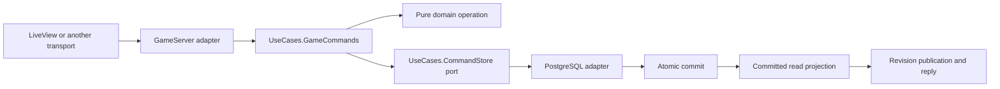

# Domain boundaries and command/query architecture

Tijara Tides is a modular monolith with a pure domain, a transport-independent
application layer, PostgreSQL adapters, and Phoenix LiveView presentation. One
GenServer remains the authoritative writer for each running world. The world is
the current transaction boundary; the modules below are responsibility boundaries,
not independently deployed services. Account, Ship, CompanyFinance and
PortCargoMarket have explicit aggregate roots; their changes commit in the shared world transaction.

## Responsibilities

| Area | Owner | Invariants |
|---|---|---|
| Identity and company formation | `Domain.Account` | Valid durable sessions; one active company per account; invitation entitlement lifecycle; zero-asset formation and explicit borrowing. |
| Repeating routes | `Domain.Ship` with internal `Ship.RoutePlan` | Private bounded stop templates; durable visit cursor and phase; fresh load shortfalls per visit; pause without cancelling committed movement. |
| Ship operation | `Domain.Ship`; `Fleet` coordinates financial settlement | Ownership and handling status before departure; fuel funding and reservation; capacity measured in kg/litres; fuel and crew costs settled once. |
| Cargo | `Domain.CargoRules`, `CargoLots` | Hold compatibility, liquid mixing restrictions, freshness, stable lot identity and split lineage. |
| Trading | `Domain.Trading` | Atomic cash, cargo, liquidity and accounting changes; destination funding rechecked before purchase. |
| City markets | `Domain.PortCargoMarket` | Bounded stock, demand and budgets; finite manufactured stock; no synthetic merchant inventory; world-time replenishment. |
| Credit and insolvency | `Domain.CompanyFinance` | Fixed loan terms, oldest-due settlement, protected reservations, shared active-clock arrears, bankruptcy and replacement entitlement. |
| Accounting | `Domain.CompanyFinance`, `Domain.Journal`, persistence ledger adapter | Balanced integer-cent entries; durable ledger and entity balances committed together and reconciled. |
| Financial accumulation | `Domain.Reporting`, `UseCases.CommitPreparation` | Integer capital-time integration and accounting categories; apply pending journal events before commit, clear only after success. |
| Visibility | `Domain.Visibility` | Public ships never expose cargo, balances, credentials or private instructions; owner projections require authentication. |
| Clock orchestration | `Domain.Simulation` | Advance the supplied clock once, settle finance before and after fleet operations, then market recovery, ship instructions and invitation expiry in the established order; commit all phases together. |

`Domain.ReadState` exports only reads for application projections.
`Domain.State` is unexported internal state-access machinery, not a general
application write API. The compatibility facade exposes no generic put/delete
operations; sign-out goes through `Account.sign_out/2`. A change to an entity belongs in the domain operation that owns its
rules. A row or map is not automatically a DDD aggregate.

`Domain.Trade` is an explicit trade intention; execution still validates its
values against current state. `Domain.Capacity` is an occupied-capacity value.
Durable entities retain their existing string-keyed representation behind the
relational mapper to preserve stored data and wire compatibility. New types do
not authorize bypassing ownership, funding or lifecycle checks.

`Domain.Game` remains a compatibility facade. New rules belong to the focused
modules, not that facade. These responsibilities can guide future bounded-context
design, but trading and fleet are not independent contexts: they currently
participate in shared synchronous invariants.

## Command execution and atomicity

The adapter supplies credentials, time, identifiers and persistence context.
`CommandRequest` carries the original payload, request ID and fingerprint.
`GameCommands.run` authenticates the session, validates the payload, checks the
durable receipt, invokes
the domain operation, and commits changed state with its receipt and accounting.
The persistence adapter wraps the existing `GameStore` transaction rather than
introducing a second transaction around it.

The SQL transaction locks the world row and checks the ownership epoch. It writes
changed rows, lot records, journal entries, the command receipt and world metadata
together. No successful command acknowledgement or revision publication precedes
that commit.

Invalid or expired sessions return `:invalid_session`; non-map payloads return
`:invalid_command_payload`, payloads over 12 keys return
`:too_many_command_fields`, and payloads over 4096 encoded bytes return
`:command_payload_too_large`. These validation errors do not touch persistence.

A business rejection leaves the current state available and unchanged. A commit
failure stops normal world operation; an unexpected storage or domain exception
is classified by the adapter and also stops the world. A retry with the same
request and fingerprint returns the stored result; conflicting payload reuse
fails. Both the initial receipt check and a receipt discovered inside the
transaction use the same result-decoration path. Plaintext invitation credentials
remain outside durable receipts.

`CommandResult.committed?` distinguishes new commits from replay, so replay does
not increment the revision or publish a fictitious change. Seed, redemption,
sign-out and simulation progression retain their established lifecycle handlers
and share the same commit-before-publication discipline.

Before splitting world transactions into smaller aggregates, explicitly resolve
cross-company trades, liquidity competition, cargo ownership and financial
conservation. A process-per-ship split alone would not solve those invariants.

## Query responsibilities and consistency

`UseCases.GameQueries` owns pure planning and display-data calculations:
destination comparisons, affordable trade limits, purchase estimates, cargo
market rows and ROI ordering, port cargo visibility, and consolidated/sorted
manifests. The infrastructure read adapter supplies the loaded catalogue.
LiveView owns selections, menus, formatting and layout, not these calculations.

`WorldProjection` is a typed public read model containing the map/public world
and market quotes for one committed revision. It is built on startup and replaced
after a successful state commit, before publication. Multiple snapshots reuse it.
A failed transaction never replaces it. The projection is disposable and is
rebuilt from authoritative state after restart; it is not a second source of truth.

Private projections are built only after validating the requesting session
against current state and wall-clock expiry. They are not stored in the shared
public projection. Query helpers consume the appropriate projection; filtering
in JavaScript or LiveView is not a privacy boundary.

Snapshots and voyage previews still execute through the owning GenServer. This
retains ordered, current reads without a second process, separate database or
eventual-consistency protocol. UI-side pure query transformations run outside
that mailbox. If load warrants independently served reads later, their access
control, revision consistency and failure behavior need explicit tests first.

This is lightweight CQRS with distinct command workflows and read projections.
It is not event sourcing: PostgreSQL entity state is authoritative, and the
financial ledger is accounting history rather than a replay log for all gameplay.

## Financial report reads and writes

`Journal` emits balanced accounting events without calling reporting code.
`CommitPreparation` applies their financial effects and accrues period totals
for commands, simulation, and lifecycle writes before the shared transaction.
Only a successful commit clears events and compacts closed report periods.

`ReportQueries` owns period selection, retention, eligibility and public-field
policy. Its `ReportStore` port is implemented by the PostgreSQL adapter. Queries
read one selected period in pages of at most 10 rows per list, apply owner scoping
in SQL, and verify world epoch/revision/clock in a read-only repeatable-read
transaction. Revision races re-plan and retry at most twice. SQL runs in the requesting
process after the world owner authenticates and prepares the query, leaving the
world mailbox free. Owner history has independent pagination.
Archived summaries stay in relational storage; only current quarter
and year accumulators are restored into world memory. Compaction never deletes
archived database rows.

The financial panel renders a prepared page. It requests data on opening, changing
selection, paging or explicit refresh; ordinary world ticks do not reload history.
A report read failure leaves gameplay available and offers a retry. The ledger
and summaries remain atomically committed; this is CQRS, not event sourcing.

## Change and verification rules

- Domain code cannot depend on processes, storage, transport or wall-clock access;
  the strict `Boundary` configuration enforces dependency separation.
- Application workflows depend on domain rules and persistence ports, not Ecto
  or Phoenix. Infrastructure implements those ports.
- Preserve command fingerprints and durable receipt results across refactors.
- Put economic estimates beside the domain rules they reuse or in pure query
  projections; presentation formats the result.
- Prove atomicity, replay, failure behavior and privacy with tests, not only module
  naming. Existing PostgreSQL tests cover conservation, rollback, owner fencing,
  restart recovery and request replay. Workflow tests inject both replay paths and
  commit failures; browser tests cover the query-driven UI.
- This refactor needs no SQL migration, data reset or gameplay rebalance. Existing
  startup ownership fencing and deployment procedures remain applicable.

## Single-visit ship instructions

`Domain.Ship` and its internal `Ship.VisitOrders` own private next-visit plans, partial-fill progress,
spending caps and cancellation. `Domain.Commands` dispatches creation and
cancellation through the existing receipt-protected command workflow. Successful
manual departure cancels waiting remainders and incompatible destination plans.
Simulation attempts instructions after fleet handling and market replenishment,
using the same `Trading.execute` operation as manual trades. A tick commits fills,
lot identities, ledger postings, instruction progress and notices together before
publication. Failed quantity probes are discarded pure state values.

`game_ship_instructions` stores typed relational rows with ship, company, cargo
and port references. Apply migration `20260908000000` before running this code.
Only authenticated owner projections include these rows. There are no separate
order timers or offline catch-up: retries use the existing suspended world clock.

`game_visit_plans` stores one private onward plan per ship/port visit independently
of cargo orders, enabling empty and sell-only legs. Both tables are created by
the initial instruction migration `20260908000000`; no intermediate instruction
schema is deployed. Conflicting instructions stay paused until explicitly
resolved. `instruction_onward` creates or updates the visit plan and its
outstanding buy instructions in one command transaction.
A successful departure consumes the current visit plan and removes plans for a
different next destination. Arrival suggests the saved onward leg in the UI;
manual departure remains the default. Visit plans persist `auto_depart` and a
waiting reason. After processing all cargo instructions, the same simulation tick
calls `Fleet.sail` for opted-in docked ships whose visit orders are filled or
cancelled. Handling, route availability, unpaid costs and fuel/canal funding still
apply. Departure, plan consumption, ledger entries and notices commit together;
failed persistence cannot publish or retain a departure. Failed departure checks
keep the plan for retry and emit a notice only when the reason changes. No cash
or cargo moves merely by saving a plan.

Container startup migrates configured storage before booting the supervision
tree. `Release` coordinates `Ecto.Migrator` through `SchemaMaintenance`: schema
changes serialize with world claims and fence earlier world epochs. Migration
failure prevents startup; migration-free restarts do not change world epochs
until the normal world claim.

## Repeating route orchestration

`Ship.RoutePlan`, behind the `Ship` root, validates private route templates and
materializes one visit at a time into `Ship.VisitOrders`. Sale instructions finish
before loading targets
are evaluated against retained cargo. The existing trading and fleet operations
remain responsible for cash, cargo, handling and departure invariants.
`Ship.consume_departure` advances the route only after a successful departure;
failed commits cannot publish a new cursor. Paused routes emit no new fills or
automatic departures. Bankruptcy removes route configuration and pending visits.

`game_ship_routes`, `game_route_stops` and `game_route_rules` are typed relational
tables with foreign keys and bounded positions/quantities. They use the existing
fenced transaction and command receipt workflow. `GameQueries.route_editor`
prepares the owner-only editor model; the component formats it. No public world
projection contains route cargo targets, limits or budgets.

### Exception diagnostics

Caught server exceptions use Infrastructure.ExceptionLog to record their type,
message, and stack trace. Do not substitute a type-only or generic failure log.
The formatter redacts common credential formats, database row details, and
embedded values in pattern-matching exceptions; stack frames retain arity rather
than argument values. Never deliberately include credentials or request bodies
in exception messages. Process-exit payloads remain summarized because they can
contain complete GenServer requests. Expected validation failures remain normal
error results rather than exceptions.

## Ship aggregate migration

`Ship` is the root for hull, cargo, handling, voyage, route template and active
visit lifecycle. `record_purchase`, `record_sale`, `begin_voyage`, `advance` and
`retire` protect ship invariants. Trading and Fleet coordinate these transitions
with company/market changes and journals; they no longer write ship rows.
`advance` returns operating effects for settlement rather than mutating company
balances itself. `ShipClass` holds immutable hull definitions independently of
movement orchestration.

`Ship.RoutePlan` separates editable templates from `Ship.VisitOrder` snapshots.
`QuantityPolicy` represents fixed versus maximum intent; visit fills enforce
monotonic quantity and spending bounds. Route and instruction command entry
points go through `Ship`; the former top-level modules remain compatibility
facades. The architecture test forbids direct writes to ship-owned entity kinds
outside the Ship implementation. Bankruptcy invokes root lifecycle cleanup.

The relational mapper and read projections continue to use the established row
shape. `from_row`/`to_row` are adapters, and `from_world` assembles a ship and its
owned children. Route orchestration still accepts the world as its internal
coordination context: this is an incremental aggregate migration, not an
independently loadable repository for every operation. CompanyFinance and
PortCargoMarket ownership is described below. Global map-diff persistence, the world lock, epoch fencing and atomic journals remain unchanged;
explicit changed-root persistence is deferred until all mutation paths have
aggregate ownership. No schema migration or gameplay rebalance is required.

## Company finance aggregate

`CompanyFinance` owns company financial balances, loans, installments, operating
bills and sponsor pledges. Its `apply_entries` transition derives cash, reserved
cash, payables and trading profit from balanced integer accounting entries.
`post` saves those balances and records the same entries together; callers no
longer calculate a separate balance mutation. Reservations cannot be spent as
available cash, and settlement cannot overdraw reservations or payables.

Fleet and Trading coordinate financial settlement with Ship transitions inside
the existing atomic world transaction. `ship_operations` pays crew from free
cash, consumes fuel reservations and records unpaid operating bills. Loan and
company receivership rules reside in the root; guarantee coordination resides
in `CompanyFinance.Guarantees`. A guarantee belongs to its sponsoring company's
finances and references the beneficiary; it is not embedded in two aggregates.
`Finance` and `Guarantees` remain compatibility entry points.

The typed financial root can load its owned children with `from_world`.
Lifecycle orchestration still uses the internal world context, including account
lifecycle transitions through Account and cross-company guarantee settlement. This is not an independently
committed repository: the world writer, fencing and atomic ledger persistence
remain unchanged. No schema or financial-policy migration is required.

## Port cargo market aggregate

Each `PortCargoMarket` root is identified by a port/cargo pair and owns stock,
demand, buyer budget, supplier freshness batches and the production cursor.
`quote` derives the current bid and ask. `supply` releases available cargo and
creates or splits permanent lots; `receive_cargo` consumes buyer demand and
budget. Consumer purchases disappear into consumption; merchants retain stock.
Neither transition can oversell inventory or overdraw buyer demand or funds.

`replenish` removes expired supplier stock, replenishes raw production, and
recovers demand and budgets using the existing active-world cadence. Manufactured
supply remains finite and merchants never synthesize inventory. Trading
coordinates market transitions with Ship and CompanyFinance in the same world
transaction, so failed settlement cannot leave cargo or cash partially moved.
The world context supplies the clock and lot identity sequence; `Markets` remains
a compatibility facade. Persistence row shapes, pricing and replenishment policy
are unchanged, and no database migration is needed.

Architecture regression tests prohibit direct financial, market and ship entity
writes outside their owning implementations. Generic state adapters remain
internal. These guards supplement invariant and transaction tests; they do not
make aggregates separate processes or independently committed units.

## Account aggregate

`Account` owns account identity, company association, device sessions, invitation
quota and lifecycle, verified email credentials, bankruptcy history, suspension
and reinstatement. Its typed root exposes current state and owned children via
`from_world`. `Account.EmailIdentity` handles credential requests, redemption and
delivery state; transport, hashing and sending mail stay outside the domain.
`Accounts` and `EmailIdentity` remain compatibility facades.

CompanyFinance closes the insolvent company's finances, then calls
`Account.record_bankruptcy` to detach that company, append its history exactly
once and apply account suspension. Recent-history counting and restart cooldown
queries belong to Account; lending policy remains in CompanyFinance. Guarantee
funds remain owned by the sponsoring company's finances. Account reinstatement
requires a pledged guarantee from the original sponsor for that beneficiary.
All these transitions still commit in one atomic world transaction.

Company attachment validates ownership and exclusive active membership.
Invitation commands reload current account state so stale snapshots cannot
restore spent quota. Expiry restores unused quota only once. Verified email
binding prevents identity and session reassignment across accounts. Delivery
acknowledgements update current credential rows, preserving redemption that
happened after dispatch. Existing wall-clock credential expiry and active-world
invitation expiry are preserved.

Account commands still use the shared world context to enforce unique email
ownership, invitation redemption and company-name uniqueness across accounts.
Seed invitations and anonymous email requests exist before an account does;
they are handled by the same identity lifecycle implementation rather than
attached to a fictitious player. Account is not a separately committed service.
An architecture regression test guards account-owned writes, alongside the
existing Ship, CompanyFinance and PortCargoMarket guards. Relational tables,
world fencing, map-diff persistence and wire shapes are unchanged. No migration
or authentication-policy change is required by this extraction.

## Mutation API hardening

Ship and PortCargoMarket row stores are private. Coordinators call named
transitions that reload current rows and validate the operation before saving.
Reporting restores its own baseline; application commit preparation no longer
merges entity maps. Architecture checks cover public row-store exposure and
application-layer generic mutations in addition to entity ownership checks.

## Cross-aggregate services

`Services.CompanyFormation`, `Services.TradeSettlement`, `Services.Bankruptcy`
and `Services.AutomatedVisits` coordinate the named roots in a single world
transaction. Automated visits submit trades and departures, then ask Ship to
record progress; they do not write child rows. Bankruptcy asks CompanyFinance to
close financial obligations, Ship to cancel automation and Account to record the
personal consequences. Compatibility facades retain existing callers. No service
commits independently or publishes intermediate results.

## Explicit persistence changes

`State.put/delete` record touched row identities and explicit deletions with a
monotonic mutation sequence. `GameRows` consumes that change set in dependency
order and still updates only changed SQL columns and cargo locations. It no
longer discovers writes by comparing every entity in the world. Journal events
and new lot identities remain append-only transaction payloads. Pending changes
are cleared only after successful acceptance; discarded probes do not mutate
the original state. Reporting compaction is cache eviction and emits no delete;
notice pruning emits actual deletions. Maintenance and tests must declare row
writes through the mutation API rather than editing entity maps directly.
