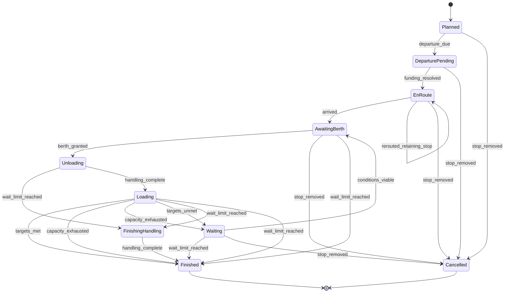
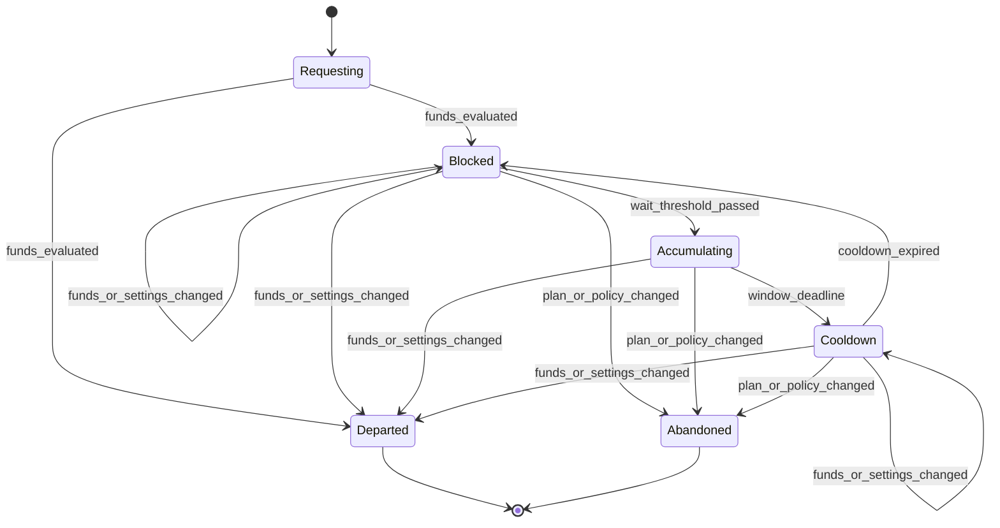
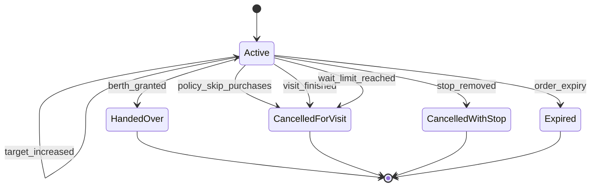
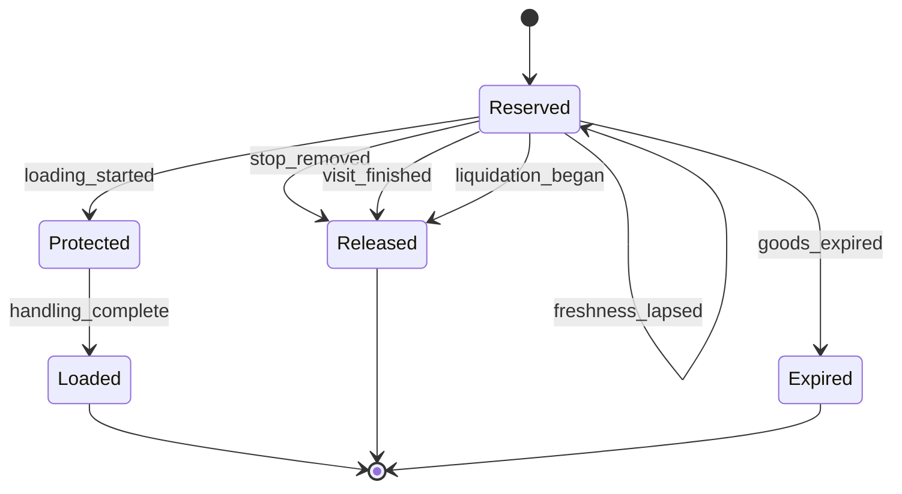
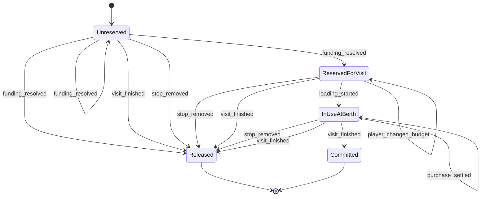

# Tijara Tides — Ship Instruction State Tables

Derived from section 8 of [the game design](DESIGN.md), which remains the
authority. Section 8 specifies roughly two hundred lines of interlocking rules
covering six concerns at once; this document restates them as explicit states,
events, guards and effects so an implementation has something unambiguous to
build against and so transaction boundaries can be drawn deliberately.

Building these tables surfaced two things section 8 had left undecided: whether
a repeating route recreates its linked remote buy order each circuit, and what
finishes a visit whose stop sets no maximum wait. Both were answered in section
8 rather than invented here, which added capacity exhaustion as a completion
condition in its own right. Anything these tables cannot derive from section 8
is listed at the end rather than guessed.

This file is generated by `scripts/gen-ship-instructions.py`, which holds the
transition data. Edit the data there and regenerate rather than editing this
file. Every diagram is emitted from the same transitions as the table beside it,
so the two cannot disagree, and `test/docs/ship_instructions_test.exs`
re-derives the invariants from the committed markdown: reachability, declared
terminals, transition determinism, rejection consistency, diagram agreement, and
a release path for every reservation from every state that can hold it. Every
transition out of a reservation's declared held states must also explicitly
release or commit it; a clean cancellation branch cannot hide a leaking success
branch. Scenario checks cover funding handoffs, cooldown departures, visit
deadlines, cancellation cleanup, and capacity-blocked loading.

Effects name reservations in a strict vocabulary: `reserve`, `release` or
`commit`, immediately followed by a declared reservation name, with any
qualifier in parentheses after it. Committing means the reservation became a
settled obligation, which is a valid exit from holding it; releasing returns it.
A reservation that can be held in a state with no path to either is a leak. The
checker fails on such a leak, and also on a verb that does not name a declared
reservation, since a misspelling there would hide a leak rather than report one.

## Stop visit

The spine. Section 8 is organised around the port call, and the other lifecycles
hang off this one's phases. Berth queueing, anchorage and handling belong to
section 10, so `berth_granted` and `handling_complete` arrive here as external
events rather than being modelled again.

| State | Kind | Meaning |
|-------|------|---------|
| Planned | initial | a configured stop the ship has not yet departed toward |
| DeparturePending | — | fuel and the configured purchase budget are being secured |
| EnRoute | — | sailing toward the stop |
| AwaitingBerth | — | in the berth queue or at anchorage under section 10 |
| Unloading | — | qualifying sales settled; sold and assigned cargo moving ashore |
| Loading | — | free capacity computed; reserved stock, owned stock, then purchases |
| Waiting | — | targets unmet, including sales or unloading on a full ship; waiting for viable conditions |
| FinishingHandling | — | wait limit reached; no new fills or handling may start; drain only committed handling |
| Finished | terminal | the visit is complete and its unused reservations released |
| Cancelled | terminal | the stop was removed or rerouted away before completion |

| From | Event | Guard | To | Effects |
|------|-------|-------|----|---------|
| Planned | departure_due | — | DeparturePending | — |
| Planned | stop_removed | — | Cancelled | notify cancellation |
| DeparturePending | funding_resolved | — | EnRoute | adopt the fuel reservation from the atomic funding operation |
| DeparturePending | stop_removed | — | Cancelled | notify cancellation |
| EnRoute | arrived | — | AwaitingBerth | commit fuel |
| EnRoute | rerouted_retaining_stop | additional fuel affordable | EnRoute | recalculate remaining fuel from current position; reuse unused fuel; reserve fuel (additional) or release fuel (excess) |
| EnRoute | stop_removed | — | Cancelled | release fuel; notify cancellation |
| AwaitingBerth | berth_granted | wait limit not reached | Unloading | hand over any linked order; settle qualifying sales; reserve hold capacity |
| AwaitingBerth | stop_removed | — | Cancelled | notify cancellation |
| AwaitingBerth | wait_limit_reached | — | Finished | leave berth queue; stop new fills; notify shortfall |
| Unloading | wait_limit_reached | — | FinishingHandling | stop new fills and handling; finish only committed handling |
| Unloading | handling_complete | — | Loading | — |
| Loading | targets_met | no handling remains | Finished | commit hold capacity |
| Loading | capacity_exhausted | sale and unload targets resolved; only loading is capacity-blocked; no handling remains | Finished | commit hold capacity; notify shortfall |
| Loading | capacity_exhausted | sale or unload targets remain; no handling remains | Waiting | commit hold capacity; preserve sale and unload targets |
| Loading | targets_unmet | free weight and volume remain; no handling remains | Waiting | commit hold capacity |
| Loading | wait_limit_reached | handling remains | FinishingHandling | stop new fills and handling; finish only committed handling |
| Loading | wait_limit_reached | no handling remains | Finished | release hold capacity; stop new fills; notify shortfall |
| FinishingHandling | handling_complete | — | Finished | release hold capacity; notify shortfall |
| Waiting | conditions_viable | wait limit not reached | AwaitingBerth | — |
| Waiting | wait_limit_reached | — | Finished | finish committed handling; notify shortfall |
| Waiting | stop_removed | — | Cancelled | notify cancellation |

Rejected events:

| State | Event | Guard | Why |
|-------|-------|-------|-----|
| Planned | berth_granted | — | a ship cannot berth before departing |
| EnRoute | berth_granted | — | instructions become executable only once the ship holds a berth |
| AwaitingBerth | handling_complete | — | queue position and anchorage are not handling; section 10 grants the berth first |
| Unloading | targets_met | — | port calls complete planned unloading before any purchase is considered |
| Waiting | capacity_exhausted | — | capacity alone cannot finish outstanding sale or unload targets |
| FinishingHandling | berth_granted | — | no new handling after the wait limit |
| FinishingHandling | purchase_requested | — | no new fills after the wait limit |
| EnRoute | rerouted_retaining_stop | additional fuel unaffordable | the reroute is rejected and the existing route and reservations are retained |

Reservations:

| Reservation | Held in states |
|-------------|----------------|
| fuel | EnRoute |
| hold capacity | Unloading, Loading, FinishingHandling |

## Departure funding

One global insufficient-funds policy per player governs every automated
departure. Fuel is never partially funded. The fuel and purchase budget reserved
on departure belong to the stop visit and earmarked budget lifecycles, which
adopt and release them. This lifecycle creates those reservations exactly once
in the successful departure operation.

| State | Kind | Meaning |
|-------|------|---------|
| Requesting | initial | evaluating whether fuel and the configured budget can be reserved |
| Blocked | — | fuel unaffordable or full budget short under Wait and notify; retrying on change |
| Accumulating | — | waited past the threshold; capturing incoming cash within a window |
| Cooldown | — | accumulation timed out; ineligible to accumulate again yet |
| Departed | terminal | requirements reserved and the ship sailed |
| Abandoned | terminal | the player changed the plan or the policy |

| From | Event | Guard | To | Effects |
|------|-------|-------|----|---------|
| Requesting | funds_evaluated | fuel and the full budget are available | Departed | reserve fuel; reserve purchase budget |
| Requesting | funds_evaluated | fuel affordable but full budget short, and the policy is Sail with a reduced budget | Departed | reserve fuel; reserve purchase budget (available amount, a strict cap) |
| Requesting | funds_evaluated | fuel affordable but full budget short, and the policy is Skip purchases | Departed | reserve fuel; cancel linked order for this visit |
| Requesting | funds_evaluated | fuel alone unaffordable, or full budget short under Wait and notify | Blocked | notify blocked once |
| Blocked | funds_or_settings_changed | current policy requirements affordable | Departed | reserve fuel; reserve purchase budget (policy amount); apply Skip purchases if selected; notify resumed once |
| Blocked | funds_or_settings_changed | current policy requirements unaffordable | Blocked | no repeated alert for an unchanged blocked state |
| Blocked | wait_threshold_passed | no company ship is accumulating and this one is not in cooldown | Accumulating | reserve accumulated cash (toward the requirement) |
| Blocked | plan_or_policy_changed | — | Abandoned | — |
| Accumulating | funds_or_settings_changed | fully funded | Departed | commit accumulated cash (convert atomically into fuel and purchase reservations); reserve fuel (from accumulated cash); reserve purchase budget (from accumulated cash); notify resumed once |
| Accumulating | window_deadline | — | Cooldown | release accumulated cash; pay overdue obligations first; run oldest-affordable allocation; notify timed out |
| Accumulating | plan_or_policy_changed | — | Abandoned | release accumulated cash |
| Cooldown | funds_or_settings_changed | current policy requirements affordable | Departed | reserve fuel; reserve purchase budget (policy amount); apply Skip purchases if selected; notify resumed once |
| Cooldown | funds_or_settings_changed | current policy requirements unaffordable | Cooldown | preserve original waiting age and cooldown deadline |
| Cooldown | cooldown_expired | — | Blocked | preserve original waiting age; retry ordinary funding |
| Cooldown | plan_or_policy_changed | — | Abandoned | — |

Rejected events:

| State | Event | Guard | Why |
|-------|-------|-------|-----|
| Requesting | depart | fuel alone is unaffordable | remain blocked and retry; never depart without fully funded fuel |
| Cooldown | wait_threshold_passed | — | the retry cooldown exists so released cash is not immediately recaptured |
| Blocked | wait_threshold_passed | another company ship is already accumulating | at most one ship per company accumulates, the longest-waiting eligible one |

Reservations:

| Reservation | Held in states |
|-------------|----------------|
| accumulated cash | Accumulating |

## Linked remote buy order

A remote buy order optionally linked to one collection stop. Fills stay at the
purchase port earmarked for that ship, so linking never substitutes future ship
capacity for warehouse space. Handover at berth is one authoritative operation,
so the order cannot fill again while the ship buys the same shortfall. The link
is a standing property of the stop: the terminal states below end one circuit's
order, and a repeating route opens a fresh one when the visit finishes, funded
and reserved separately.

| State | Kind | Meaning |
|-------|------|---------|
| Active | initial | open, reserving cash and compatible warehouse capacity |
| HandedOver | terminal | remainder cancelled at berth and fills reconciled to the target |
| CancelledForVisit | terminal | cancelled because Skip purchases applied to this visit |
| CancelledWithStop | terminal | cancelled because the collection stop was removed |
| Expired | terminal | reached its own player-set expiry |

| From | Event | Guard | To | Effects |
|------|-------|-------|----|---------|
| Active | fill | — | Active | commit remote order cash (filled quantity); commit remote order capacity (filled quantity); earmark goods for collection |
| Active | target_decreased | — | Active | release remote order cash (excess); release remote order capacity (excess) |
| Active | target_increased | sufficient unreserved cash and compatible capacity | Active | reserve remote order cash (additional); reserve remote order capacity (additional) |
| Active | berth_granted | — | HandedOver | cancel unfilled remainder; release remote order cash; release remote order capacity; reconcile fills with the loading target |
| Active | policy_skip_purchases | — | CancelledForVisit | cancel unfilled remainder; release remote order cash; release remote order capacity; notify cancellation |
| Active | stop_removed | — | CancelledWithStop | cancel unfilled remainder; release remote order cash; release remote order capacity; notify cancellation |
| Active | visit_finished | — | CancelledForVisit | cancel unfilled remainder; release remote order cash; release remote order capacity |
| Active | wait_limit_reached | — | CancelledForVisit | cancel unfilled remainder; release remote order cash; release remote order capacity |
| Active | order_expiry | — | Expired | cancel unfilled remainder; release remote order cash; release remote order capacity |

Rejected events:

| State | Event | Guard | Why |
|-------|-------|-------|-----|
| Active | target_increased | insufficient unreserved cash or compatible capacity | the combined change is rejected and the previous target, order and reservations are preserved |
| HandedOver | fill | — | handover is authoritative so the order cannot fill again while the ship buys the same shortfall |

Reservations:

| Reservation | Held in states |
|-------------|----------------|
| remote order cash | Active |
| remote order capacity | Active |

## Advance collection reservation

Specific warehouse stock earmarked for one ship's collection at that port.
Reserved goods stay in the warehouse, count against its capacity and keep
ageing. A reservation survives lease expiry through the grace period so the
assigned ship can collect, but never extends grace or postpones liquidation.

| State | Kind | Meaning |
|-------|------|---------|
| Reserved | initial | stock earmarked for this ship and unavailable to others |
| Protected | — | loading was already underway at the grace deadline |
| Loaded | terminal | collected aboard |
| Released | terminal | earmark dropped; goods remain owned and available |
| Expired | terminal | the goods expired in the warehouse |

| From | Event | Guard | To | Effects |
|------|-------|-------|----|---------|
| Reserved | freshness_lapsed | qualifying unreserved stock exists at the port | Reserved | release reserved stock (affected batch); reserve reserved stock (replacement, earliest expiry first) |
| Reserved | freshness_lapsed | no qualifying replacement exists | Reserved | release reserved stock (affected batch); notify shortfall |
| Reserved | loading_started | — | Protected | commit reserved stock to the active operation |
| Reserved | stop_removed | — | Released | release reserved stock; notify |
| Reserved | visit_finished | — | Released | release reserved stock (uncollected remainder) |
| Reserved | liquidation_began | — | Released | release reserved stock; notify that the cargo is entering liquidation |
| Reserved | goods_expired | — | Expired | discard the goods; release reserved stock (and its warehouse capacity) |
| Protected | handling_complete | — | Loaded | commit reserved stock aboard |

Rejected events:

| State | Event | Guard | Why |
|-------|-------|-------|-----|
| Protected | liquidation_began | — | the batch committed to an active loading operation finishes; other goods still enter liquidation on schedule |
| Protected | stop_removed | — | already-committed handling cannot be cancelled through stop removal |
| Reserved | berth_granted | — | a ship waiting for a berth has not collected the goods, so a queue position alone grants no extension |

Reservations:

| Reservation | Held in states |
|-------------|----------------|
| reserved stock | Reserved, Protected |

## Earmarked purchase budget

An optional advance purchase budget for one stop. When earmarked, arrival
purchases use only that budget and are never supplemented from unreserved cash,
sale proceeds, or cash released by linked orders. Cash reserved for fuel and for
purchases stays distinct; neither can fund the other.

| State | Kind | Meaning |
|-------|------|---------|
| Unreserved | initial | no budget earmarked; arrival purchases use unreserved cash |
| ReservedForVisit | — | earmarked before departing toward the stop |
| InUseAtBerth | — | being spent during the loading phase as a strict cap |
| Released | terminal | unused funds returned, or no funds earmarked; any skip-purchases decision remains in force |
| Committed | terminal | fully spent on settled trades |

| From | Event | Guard | To | Effects |
|------|-------|-------|----|---------|
| Unreserved | funding_resolved | an advance budget was earmarked, including a reduced zero amount | ReservedForVisit | adopt the purchase reservation from the atomic funding operation |
| Unreserved | funding_resolved | no advance budget configured and purchases permitted | Unreserved | arrival uses unreserved cash within the stop cap |
| Unreserved | funding_resolved | Skip purchases applies | Released | disable arrival purchases for this visit |
| Unreserved | visit_finished | — | Released | — |
| Unreserved | stop_removed | — | Released | — |
| ReservedForVisit | player_changed_budget | within available funds and existing commitments | ReservedForVisit | reserve purchase budget (adjusted amount) |
| ReservedForVisit | loading_started | — | InUseAtBerth | — |
| ReservedForVisit | stop_removed | — | Released | release purchase budget (unused; preserve committed amounts) |
| ReservedForVisit | visit_finished | — | Released | release purchase budget (unused) |
| InUseAtBerth | stop_removed | — | Released | release purchase budget (unused; preserve settled trades and committed handling) |
| InUseAtBerth | purchase_settled | within remaining budget | InUseAtBerth | commit purchase budget (spent portion) |
| InUseAtBerth | visit_finished | unused funds remain | Released | release purchase budget (unused portion) |
| InUseAtBerth | visit_finished | fully spent | Committed | commit purchase budget (remaining balance is zero) |

Rejected events:

| State | Event | Guard | Why |
|-------|-------|-------|-----|
| InUseAtBerth | sale_proceeds_received | — | an earmarked budget stays strict despite newly received sale proceeds |
| Unreserved | departure_due | — | funding is only requested; budget ownership changes on successful atomic funding |

Reservations:

| Reservation | Held in states |
|-------------|----------------|
| purchase budget | ReservedForVisit, InUseAtBerth |

## Interaction points

Where one lifecycle's transition drives another's. These are the seams a
transaction boundary has to respect: section 8 requires several of them to apply
as one authoritative operation so demand is not duplicated or partially updated.

| When | Then |
|------|------|
| Stop visit enters DeparturePending | Departure funding starts at Requesting. The earmarked budget stays Unreserved; departure_due reserves no cash. |
| Departure funding reaches Departed | The stop visit leaves DeparturePending on `funding_resolved`, and the budget consumes that same event. One authoritative operation evaluates fuel plus the policy budget, creates both reservations once, converts any accumulated cash, updates both lifecycles, and departs. Consumers adopt these reservations without reserving cash again; retries use the same departure ID. This applies equally to immediate funding and delayed retries. |
| Departure funding resolves as Skip purchases | The linked remote buy order takes `policy_skip_purchases` and cancels its remainder for that visit. Completed fills stay owned and earmarked, because the ship still visits the stop. |
| Stop visit enters Unloading on berth_granted | The linked remote buy order takes `berth_granted` and hands over. The replacement purchase happens later, in the visit's Loading phase, not at handover. |
| Stop visit enters Loading | The earmarked budget takes `loading_started`, and the advance collection reservation takes `loading_started` for stock being collected. |
| Stop visit reaches Finished or Cancelled | The earmarked budget takes `visit_finished` or `stop_removed`; active linked orders and uncollected reservations take the same event, releasing unused resources even when no berth was granted. Committed handling is never reversed. Budget stop_removed is valid after loading has begun, including while the visit waits. |
| Stop visit reaches Finished on a repeating route | The stop's standing link opens a fresh linked remote buy order for the next circuit, so it has the whole circuit to fill before the ship returns. Nothing carries across from the previous circuit's order. |
| Stop visit wait limit is reached | At arrival, start one visit deadline; retries do not reset it. At or after it, reject new fills and handling before dispatching any competing event. AwaitingBerth and Waiting finish directly; Unloading and Loading drain only committed handling in FinishingHandling, then finish. Any active linked order takes wait_limit_reached in the same operation, stopping its fills immediately rather than waiting for committed handling to finish. |
| Warehouse lease liquidation begins | The advance collection reservation takes `liquidation_began` unless loading is already underway, in which case only the committed batch is protected. |
